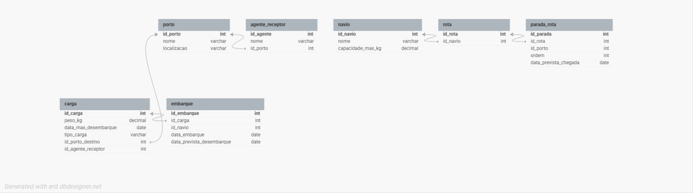

# MODELAGEM E IMPLEMENTAÇÃO DE SISTEMA DE TRANSPORTE MARÍTMO
### ALUNOS: HIGOR RAFAEL FERREIRA NUNES, CARLOS EMANUEL DE SOUSA SILVA
### DISCIPLINA: BANCOS RELACIONAIS
### DATA: 05/02/2026
### PROFESSOR: MARCONDES JOSINO ALEXANDRE

 

# Introdução
### Este projeto apresenta a solução de banco de dados para uma empresa de transporte marítimo, com o objetivo de automatizar a alocação de cargas em navios considerando capacidade e destino. O sistema foi projetado para garantir a integridade do transporte e o controle de prazos e multas. A solução abrange desde a modelagem conceitual até a implementação de objetos complexos como views e consultas analíticas para ajudar a decisão do supervisor.

# MODELAGEM CONCEITUAL

## Nesta etapa, o foco foi mapear as regras de negócio e como os diferentes elementos do cenário logístico se conectam. Em vez de focar em comandos técnicos, definimos a hierarquia das informações:

* Gestão de Cargas: A entidade central armazena não apenas o peso, mas também temperatura máxima e data de validade, essenciais para cargas sensíveis e perecíveis.

* Logística de Transporte: Estruturamos a relação entre navios e rotas para garantir que cada embarque seja único e direto, respeitando a capacidade máxima de cada embarcação.

* Rede de Destinos: O sistema conecta portos e agentes receptores, garantindo que cada parada da rota tenha um responsável designado para a recepção da mercadoria.

* Regras de Negócio: Definimos que a alocação depende da disponibilidade de peso no navio e da compatibilidade do itinerário com a data limite de desembarque da carga

# MODELAGEM LÓGICA E IMPLEMENTAÇÃO
### A implementação física foi realizada no SQL Server, utilizando tipos de dados como (decimal para pesos e date para prazos) e restrições de integridade. O código abaixo demonstra a criação das tabelas, chaves e inserts:

-- Criação do banco de dados
CREATE DATABASE db_TransporteMaritimo;
GO

USE db_TransporteMaritimo;
GO

-- Tabela: Porto
CREATE TABLE Porto (
    IdPorto INT IDENTITY(1,1) PRIMARY KEY,
    Nome NVARCHAR(100) NOT NULL,
    Localizacao NVARCHAR(100)
);

-- Tabela: AgenteReceptor
CREATE TABLE AgenteReceptor (
    IdAgente INT IDENTITY(1,1) PRIMARY KEY,
    Nome NVARCHAR(100) NOT NULL,
    IdPorto INT NOT NULL,
    FOREIGN KEY (IdPorto) REFERENCES Porto(IdPorto)
);

-- Tabela: Navio
CREATE TABLE Navio (
    IdNavio INT IDENTITY(1,1) PRIMARY KEY,
    Nome NVARCHAR(100) NOT NULL,
    CapacidadeMaxKg DECIMAL(12,2) NOT NULL
);

-- Tabela: Rota
CREATE TABLE Rota (
    IdRota INT IDENTITY(1,1) PRIMARY KEY,
    IdNavio INT NOT NULL,
    FOREIGN KEY (IdNavio) REFERENCES Navio(IdNavio)
);

-- Tabela: ParadaRota
CREATE TABLE ParadaRota (
    IdParada INT IDENTITY(1,1) PRIMARY KEY,
    IdRota INT NOT NULL,
    IdPorto INT NOT NULL,
    Ordem INT NOT NULL,
    DataPrevistaChegada DATE NOT NULL,
    FOREIGN KEY (IdRota) REFERENCES Rota(IdRota),
    FOREIGN KEY (IdPorto) REFERENCES Porto(IdPorto)
);

-- Tabela: Carga
CREATE TABLE Carga (
    IdCarga INT IDENTITY(1,1) PRIMARY KEY,
    PesoKg DECIMAL(10,2) NOT NULL,
    DataMaxDesembarque DATE NOT NULL,
    TipoCarga NVARCHAR(20) NOT NULL, -- 'perecivel', 'sensivel', 'outros'
    DataValidade DATE NULL,           -- para perecíveis
    TemperaturaMax DECIMAL(5,2) NULL, -- para sensíveis
    Status NVARCHAR(20) DEFAULT 'não embarcada',
    IdPortoDestino INT NOT NULL,
    IdAgenteReceptor INT NOT NULL,
    FOREIGN KEY (IdPortoDestino) REFERENCES Porto(IdPorto),
    FOREIGN KEY (IdAgenteReceptor) REFERENCES AgenteReceptor(IdAgente)
);

-- Tabela: Embarque
CREATE TABLE Embarque (
    IdEmbarque INT IDENTITY(1,1) PRIMARY KEY,
    IdCarga INT NOT NULL UNIQUE, -- Cada carga só pode ser embarcada uma vez
    IdNavio INT NOT NULL,
    DataEmbarque DATE NOT NULL,
    DataPrevistaDesembarque DATE NOT NULL,
    FOREIGN KEY (IdCarga) REFERENCES Carga(IdCarga),
    FOREIGN KEY (IdNavio) REFERENCES Navio(IdNavio)
);

-- Constraint para limitar os valores de TipoCarga
ALTER TABLE Carga ADD CONSTRAINT CHK_TipoCarga CHECK (TipoCarga IN ('perecivel', 'sensivel', 'outros'));

-- Constraint para limitar os valores de Status
ALTER TABLE Carga ADD CONSTRAINT CHK_StatusCarga CHECK (Status IN ('embarcada', 'não embarcada'));

# MANIPULAÇÃO E CONSULTAS
### Nesta parte, exploramos a inserção de dados (DML) e a criação de relatórios (Views e Selects) com junções e agrupamentos.

* INSERTS
-- Insert 01: Porto

INSERT INTO Porto (Nome, Localizacao) VALUES
('Porto de Santos', 'Santos - SP'),
('Porto do Rio de Janeiro', 'Rio de Janeiro - RJ'),
('Porto de Paranaguá', 'Paranaguá - PR'),
('Porto de Itajaí', 'Itajaí - SC'),
('Porto de Suape', 'Ipojuca - PE'),
('Porto de Manaus', 'Manaus - AM'),
('Porto de Vitória', 'Vitória - ES'),
('Porto de Salvador', 'Salvador - BA'),
('Porto de Recife', 'Recife - PE'),
('Porto de Fortaleza', 'Fortaleza - CE');

-- Insert 02: AgenteReceptor

INSERT INTO AgenteReceptor (Nome, IdPorto) VALUES
('Agente Santos', 1),
('Agente Rio', 2),
('Agente Paranaguá', 3),
('Agente Itajaí', 4),
('Agente Suape', 5),
('Agente Manaus', 6),
('Agente Vitória', 7),
('Agente Salvador', 8),
('Agente Recife', 9),
('Agente Fortaleza', 10);

-- Insert 03: Navio

INSERT INTO Navio (Nome, CapacidadeMaxKg) VALUES
('Navio Atlântico', 500000.00),
('Navio Pacífico', 450000.00),
('Navio Mercosul', 400000.00),
('Navio Brasil', 350000.00),
('Navio Amazonas', 300000.00),
('Navio Nordeste', 250000.00),
('Navio Sul', 200000.00),
('Navio Leste', 150000.00),
('Navio Oeste', 100000.00),
('Navio Central', 80000.00);

-- Insert 04: Rota

INSERT INTO Rota (IdNavio) VALUES
(1), (2), (3), (4), (5), (6), (7), (8), (9), (10);

-- Insert 05: ParadaRota

INSERT INTO ParadaRota (IdRota, IdPorto, Ordem, DataPrevistaChegada) VALUES
(1, 1, 1, '2024-07-01'),
(1, 2, 2, '2024-07-03'),
(2, 3, 1, '2024-07-02'),
(2, 4, 2, '2024-07-04'),
(3, 5, 1, '2024-07-05'),
(3, 6, 2, '2024-07-07'),
(4, 7, 1, '2024-07-06'),
(4, 8, 2, '2024-07-08'),
(5, 9, 1, '2024-07-09'),
(5, 10, 2, '2024-07-11');

-- Insert 06: Carga

INSERT INTO Carga (PesoKg, DataMaxDesembarque, TipoCarga, DataValidade, TemperaturaMax, Status, IdPortoDestino, IdAgenteReceptor) VALUES
(10000.50, '2024-07-10', 'perecivel', '2024-07-09', NULL, 'não embarcada', 1, 1),
(8000.00, '2024-07-12', 'sensivel', NULL, -5.0, 'não embarcada', 2, 2),
(12000.75, '2024-07-15', 'outros', NULL, NULL, 'não embarcada', 3, 3),
(9500.20, '2024-07-18', 'perecivel', '2024-07-17', NULL, 'não embarcada', 4, 4),
(7000.00, '2024-07-20', 'sensivel', NULL, -10.0, 'não embarcada', 5, 5),
(15000.00, '2024-07-22', 'outros', NULL, NULL, 'não embarcada', 6, 6),
(11000.30, '2024-07-25', 'perecivel', '2024-07-24', NULL, 'não embarcada', 7, 7),
(9000.00, '2024-07-28', 'sensivel', NULL, -8.0, 'não embarcada', 8, 8),
(13000.60, '2024-07-30', 'outros', NULL, NULL, 'não embarcada', 9, 9),
(10500.40, '2024-08-02', 'perecivel', '2024-08-01', NULL, 'não embarcada', 10, 10);

-- Insert 07: Embarque

INSERT INTO Embarque (IdCarga, IdNavio, DataEmbarque, DataPrevistaDesembarque) VALUES
(1, 1, '2024-07-01', '2024-07-10'),
(2, 2, '2024-07-02', '2024-07-12'),
(3, 3, '2024-07-03', '2024-07-15'),
(4, 4, '2024-07-04', '2024-07-18'),
(5, 5, '2024-07-05', '2024-07-20'),
(6, 6, '2024-07-06', '2024-07-22'),
(7, 7, '2024-07-07', '2024-07-25'),
(8, 8, '2024-07-08', '2024-07-28'),
(9, 9, '2024-07-09', '2024-07-30'),
(10,10,'2024-07-10','2024-08-02');

* VIEWS
-- View 01: Cargas com informações do Porto de Destino e Agente Receptor

CREATE VIEW vw_Cargas_Destino_Agente AS
SELECT 
    c.IdCarga,
    c.PesoKg,
    c.DataMaxDesembarque,
    c.TipoCarga,
    c.Status,
    p.Nome AS PortoDestino,
    a.Nome AS AgenteReceptor
FROM 
    Carga c
    INNER JOIN Porto p ON c.IdPortoDestino = p.IdPorto
    INNER JOIN AgenteReceptor a ON c.IdAgenteReceptor = a.IdAgente;

-- View 02: Total de cargas por tipo

CREATE VIEW vw_Total_Cargas_Por_Tipo AS
SELECT 
    TipoCarga,
    COUNT(*) AS QuantidadeCargas,
    SUM(PesoKg) AS PesoTotal
FROM 
    Carga
GROUP BY 
    TipoCarga;

-- View 03: Cargas embarcadas com informações do navio

CREATE VIEW vw_Cargas_Embarcadas AS
SELECT 
    c.IdCarga,
    c.PesoKg,
    c.TipoCarga,
    n.Nome AS Navio,
    e.DataEmbarque,
    e.DataPrevistaDesembarque
FROM 
    Carga c
    INNER JOIN Embarque e ON c.IdCarga = e.IdCarga
    INNER JOIN Navio n ON e.IdNavio = n.IdNavio;

-- View 04: Rotas dos navios com paradas ordenadas

CREATE VIEW vw_Rotas_Paradas AS
SELECT 
    n.Nome AS Navio,
    r.IdRota,
    pr.Ordem,
    p.Nome AS PortoParada,
    pr.DataPrevistaChegada
FROM 
    Navio n
    INNER JOIN Rota r ON n.IdNavio = r.IdNavio
    INNER JOIN ParadaRota pr ON r.IdRota = pr.IdRota
    INNER JOIN Porto p ON pr.IdPorto = p.IdPorto;

-- View 05: Capacidade ocupada de cada navio

CREATE VIEW vw_Capacidade_Navio AS
SELECT 
    n.Nome AS Navio,
    n.CapacidadeMaxKg,
    ISNULL(SUM(c.PesoKg), 0) AS PesoOcupado,
    (n.CapacidadeMaxKg - ISNULL(SUM(c.PesoKg), 0)) AS CapacidadeDisponivel
FROM 
    Navio n
    LEFT JOIN Embarque e ON n.IdNavio = e.IdNavio
    LEFT JOIN Carga c ON e.IdCarga = c.IdCarga
GROUP BY 
    n.Nome, n.CapacidadeMaxKg;

* CONSULTAS
-- Consultas
-- Select 01:
SELECT *,

CASE
    WHEN (Status = 'não embarcada') THEN 'EMBARCAR'
    WHEN (Status = 'embarcada') THEN 'EMBARCADO'
        ELSE 'ERRO'
END AS 'ACAO'

FROM 
    vw_Cargas_Destino_Agente

ORDER BY
    TipoCarga asc, DataMaxDesembarque desc

-- Select 02:
WITH Cte_carga as (
SELECT
     *
FROM 
    vw_Total_Cargas_Por_Tipo
)

SELECT 
    TipoCarga, 
    (PesoTotal / QuantidadeCargas) AS Valor_Unit, 
    QuantidadeCargas, 
    PesoTotal, 
    SUM((PesoTotal / QuantidadeCargas) * 100 / PesoTotal) AS '%_Valor_Unit'

FROM 
    Cte_carga

GROUP BY
    TipoCarga,
    QuantidadeCargas,
    PesoTotal

-- Select 03:
SELECT * FROM vw_Cargas_Embarcadas WHERE DataEmbarque BETWEEN '2024-07-01' AND '2024-07-05'

-- Select 04:
SELECT * 

FROM 
    vw_Rotas_Paradas 

GROUP BY 
    Navio,
    IdRota,
    Ordem,
    PortoParada,
    DataPrevistaChegada

HAVING
    Navio in ('Navio Brasil')

-- Select 05:
SELECT * FROM vw_Capacidade_Navio WHERE CapacidadeMaxKg > 100000 AND Navio LIKE '%Nordeste%'

